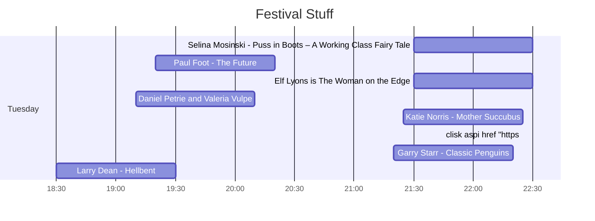

# fringe-stuff

```mermaid
---
config:
    securityLevel: 'sandbox'
---
gantt
    title Festival Stuff
    dateFormat  HH:mm
    axisFormat %H:%M
    
    section Saturday

    section Sunday
    
    section Monday

    section Tuesday

    Selina Mosinski - Puss in Boots – A Working Class Fairy Tale : sm, 21:30, 1h
    click aspi href "https://www.edfringe.com/tickets/whats-on/selina-mosinski-puss-in-boots-a-working-class-fairy-tale"

    Paul Foot - The Future : pf, 19:20, 1h
    click aspi href "https://www.edfringe.com/tickets/whats-on/paul-foot-the-future"
        
    Elf Lyons is The Woman on the Edge : el, 21:30, 1h
    click aspi href "https://www.edfringe.com/tickets/whats-on/elf-lyons-is-the-woman-on-the-edge"

    Daniel Petrie and Valeria Vulpe : dpvv, 19:10, 1h
    click aspi href "https://www.edfringe.com/tickets/whats-on/daniel-petrie-and-valeria-vulpe"

    Katie Norris - Mother Succubus : kn, 21:25, 1h
    clisk aspi href "https://www.edfringe.com/tickets/whats-on/katie-norris-mother-succubus"

    Garry Starr - Classic Penguins : gs, 21:20, 1h
    click aspi href "https://www.edfringe.com/tickets/whats-on/garry-starr-classic-penguins"    

    Larry Dean - Hellbent : ld, 18:30, 1h
    click aspi href "https://www.edfringe.com/tickets/whats-on/larry-dean-hellbent"

```
